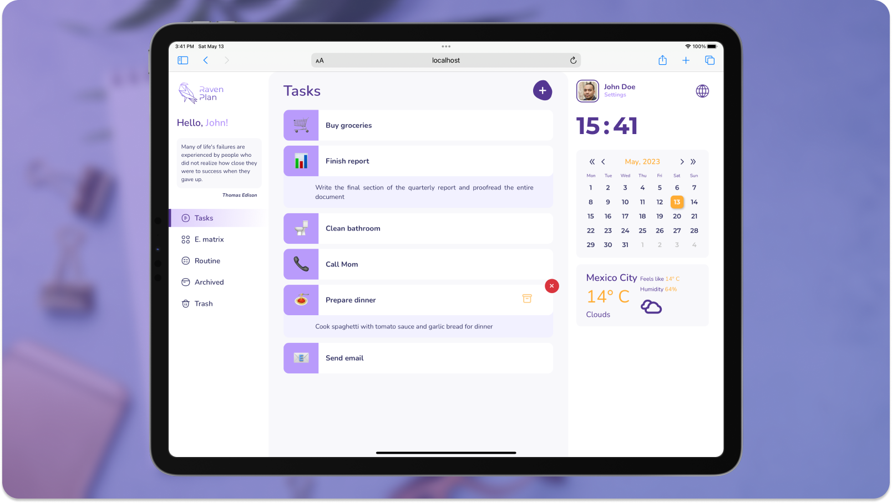

# Raven Plan - A Simple Task Manager

## Contents

[About](#about)  
[Features](#features)  
[Planned features](#planned-features)  
[Technology stack](#stack)

## About 

This is an interactive **desktop only** _demo_ version of a task manager application that started as a [CS50x](https://cs50.harvard.edu/x) final project - **Raven Plan**. The main idea was to create a convenient, easy-to-use, and fancy looking application to manage a simple tasks list. This is not a daily planner or calendar, just a to-do list that uses emoji to distingush your tasks.

> This project is currently **frozen**, and its further development is questionable. The last version was commited in December 2021, and since then, only minor changes were made to publish a demo version.

## Features 

- Create, archive, and delete tasks
- Pick and assign emojies to your tasks
- Get weather forecasts
- Choose your preferred language (English, German, or Russian)

## Planned features 

Although this project is currently frozen, here are some of the ideas we had to improve the application:

- [ ] Make the layout mobile friendly.
- [ ] Create a different route and logic for everyday routine tasks.
- [ ] Embed _Spotify_ or other music provider controls.
- [ ] Implement Task creation from e-mails and via Telegram bot.
- [ ] Extend the authentication system with OAuth2 support via popular social media platforms such as Google, Facebook, and Twitter.
- [ ] Bussiness functions: automatic reports for managers, collaboration on tasks with colleagues, task proposal from the manager.
- [ ] Generate the Eisenhower Matrix based on the tasks list that will enable users to set priorities for their tasks.
- [ ] Implement a storage for images.
- [ ] Add reminders that will signal when the due date is close.
- [ ] Make **Raven Plan** a PWA.

## Technology stack 

### Frontend 

The demo version uses [React](https://reactjs.org) template by [Vite](https://vitejs.dev). Routing is implemented with [React Router](https://reactrouter.com/). [i18next](https://www.i18next.com) is used for different laguages support and [emoji-picker-react](https://www.npmjs.com/package/emoji-picker-react) provides Emoji during task creation. Weather forecast is received from [OpenWeather](https://openweathermap.org).

### Backend 

Initially, Raven Plan's backend was developed using [Express.js](https://expressjs.com) as an API server. with authentication implemented through JSON Web Tokens (JWT) using [jsonwebtoken](https://www.npmjs.com/package/jsonwebtoken) and [bcrypt](https://www.npmjs.com/package/bcrypt) packages.  
[MongoDB](https://www.mongodb.com) as a database was handled via [mongoose](https://mongoosejs.com), providing fast and easy-to-use functionality to the server. Additionally, account activation emails were sent using [Nodemailer](https://www.npmjs.com/package/nodemailer), making the application even more user-friendly.
